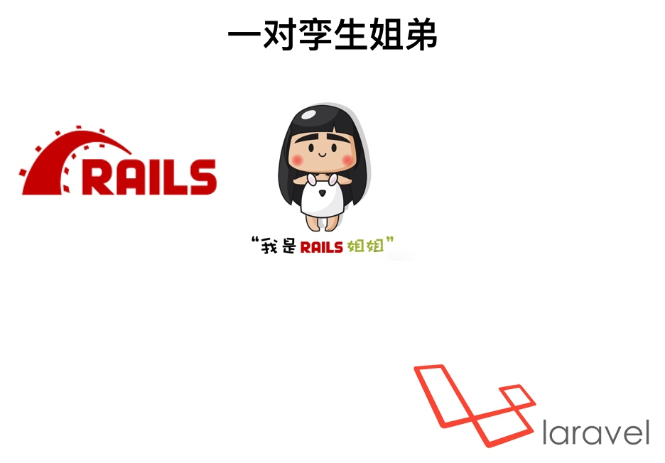

hi，我是`东哥`。本套课程叫做`《超简单的laravel新手入门教程》`，我来和你分享用 `laravel` 打造一个 `web` 应用程序的过程。

## 什么是 laravel

`The PHP Framework For Web Artisans`，laravel是适合艺术家来使用的`web`框架，一切东西都要尽可能的完美。laravel特别适合我这种代码洁癖的人使用。

laravel是目前世界上最为流行的`php`开发框架。

在`google trends`上，我对比了laravel thinkphp 和yii framework，`laravel`以绝对的优势遥遥领先。

接着我又去 github 上看了一下这三款框架他们`stars`的数量。

上面这些数据，都足以说明，现今 laravel 框架是有多火了。再不赶紧来学习下，你就真的out了。

## rails laravel 与 thinkphp 5

过去大家做 php 开发，有很多项目都是使用`thinkphp`开发的。现在却越来越多的公司开始转向使用`laravel`框架开发项目了，这也是和 laravel 开发 web 项目的便利性，完善性分不开的。

在 thinkphp 推出的5.0版本里，甚至有大量的用法都和 laravel 一模一样。

其实 laravel 本身的各种新的思想、用法，也并不是自己原创的。他们都是来自于`ruby on rails`这一款框架。
因为`rails`在先，`laravel`在后，他们两个又有太多相似的地方了。所以说  rails 与 laravel 是一对孪生的姐弟。

我个人是先接触的 rails框架 ，后接触的 laravel 的。当时看到 laravel 框架后，感到一切都是那么熟悉，甚至不需要太看文档，都基本知道 laravel 应该怎么使用。

网络上有不少 laravel 的教程都比较过时了，教的依然还是过去`传统php开发`的那一套搞法，并不是纯正的`laravel way`。

课程的主线内容，参考了peter的`rails十日谈`，我当年就是看了这一篇教程才入门了rails开发的。这一次`超简单的laravel新手入门教程`，可以算是 rails十日谈 的php版本。

## 课程适合观众

学习本课程，你不一定要多会 php。有其他编程语言基础，特别是一些会面向对象编程的更好。也不需要你先掌握 css 和 js ，但是最少要懂一点 `html`。

课程非常适合 web 开发的初学者来学习，也适合已经会用 thinkphp 或其他 php 框架的同学学习。如果你之前是使用 python 、 ruby 或者 java 、 c# 来开发 web ，现在想学习 php 开发，那本课程也是非常适合你的。

## 课程内容

课程中不用你制作乏味的静态页面，所有的页面模板我都已经准备好了，你只要改改就行。
也没有晦涩难懂的概念，上手就是干，自己动手一步步制作一个聚会的网站，可以发布聚会信息，参与者可以发表评论。

每一个知识点都是为了解决实际开发中碰到的一个个问题。坚决反对死学理论知识，不实际动手的学习方法。一切知识都应该在实践中学习掌握。

让东哥我手把手带你做一个真实的项目，让你对 web 开发，对 laravel 框架的使用有一个最清晰的认识。只有自己动手做出项目来了，有了成就感，对开发有了兴趣，你才能真正的学会这一门艺术。

好的，让我们携手一起步入世界上最流行的 `web 开发框架-laravel的世界`。

