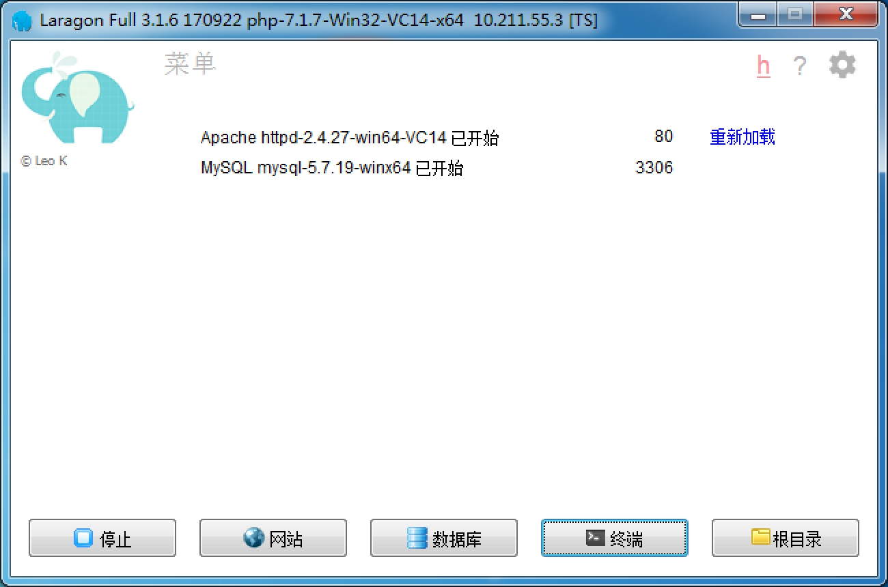
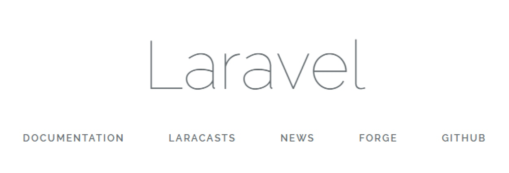

用`windows`的同学们有福了，你无需任何繁琐的配置都可以很方便的开发`laravel`，这就是`laragon`。用`laragon`做起`laravel`开发，真的无比方面好用。

它里面自带`composer`，`php`，`mysql`，`redis` `memcached`，还包含有`cmder`这个非常好用的命令行。

闲话少说，先来下载安装吧。

https://forum.laragon.org/topic/473/download-laragon


选择第一个哦，不要下错了，其他的是别的编程语言使用的。

## 安装

安装过程中，选择使用英文安装，这里一开始就选中文会乱码的。

安装的路径，不要出现空格和中文路，推荐直接装在磁盘的根目录。若是不听，装后用不了的，后果自负😁


## 基础设置

点右键，`preferences`，现在可以把`language`设置成`chinese`了，其他的一切都保持默认就好。

启动所有。




>Tips: 如果你的`apache`启动报错，可尝试将`右键`，`参数`里的`ssl`端口设置为其他端口，例如`3000`


## 设置composer为中国镜像

`php`的包管理器`composer`，默认的仓库在国外，用起来非常的慢。那么就修改为使用中国镜像，这样下载包的时候速度就会很快了。

点终端，里面跑下面的代码。

```php
composer config -g repo.packagist composer https://packagist.phpcomposer.com
```


## 开始来跑laravel项目了

`右键`，`快速创建`，选`laravel`，输入项目名称`meetup`。

等命令跑完后，`laragon`会自动配置后缀`dev`的虚拟机，打开`chrome`浏览器，输入

```php
meetup.dev
```


看到这个画面就说明，你已经成功的跑起`laravel`了

