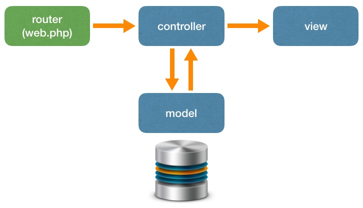

开发 web 应用是个复杂的过程，同一个功能实现方式很多，其实有时候仅仅是选择太多，就是把新手搞晕的一个重要原因。
这个问题在`php`的世界中尤其严重，实在是有太多的技术栈，太多不同的框架供你选择了。
`laravel` 有从`rails`那里借鉴来的一套 `最优的做法`，这就是 `The Laravel Way` 。


## The Laravel Way



`laravel` 的根本骨架是上面的 `mvc` 结构，不过这一集只来关注 `route` -> `controller` -> `view` 的这条线。

到 `routes/web.php` 中修改

```php
Route::get('/', 'WelcomeController@index');
Route::get('about', 'WelcomeController@about');
```

## 添加 `controller`

```bash
php artisan make:controller WelcomeController
```

```php
class WelcomeController extends Controller
{
    public function index()
    {
        return view('welcome.index');
    }
    
    public function about()
    {
        return view('welcome.about');
    }
}
```

接下来，就要来添加`html模板`了。

## views

1. 将提供的`assets文件夹`，拷贝到`meetup/public`目录。
2. 在`resources/views`目录中新建一个叫做`welcome`文件夹。
3. 把`index.html`和`about.html`拷贝到`resources/views/welcome`，并把文件后缀名都改为`blade.php`。
4. 修改`about`和`index`页面导航栏中的链接地址。

```html
<a href="/">Meetup</a>
<li><a href="/about">关于</a></li>
```

通过浏览器访问 `/`和 `/about` 现在都可以正常浏览页面了。

## 布局模板

写程序有一个原则，就是`Don't Repeat Yourself`，因为重复的代码，你改动一个地方，就要有两倍的工作量了。现在`index`之中有一大部分内容都是和`about`模板中一样的，这就造成两个模板中，存在大量重复的代码。

所以这是个问题，看看 `laravel` 怎么来解决。这就涉及到一个概念，叫做 `layout` 布局模板。

1. 到`resources/views`之中新建一个`layouts`文件夹。
2. 将`about.blade.php`复制到`layouts`，并改名为`app.blade.php`。
3. 找到和`index`页面不同的中间部分。用`@yield('content')`代码替代。这样一个布局模板就已经定义完了。
4. 再来到`about.blade.php`中，删除所有共同的部分，只保留不同的地方。加上这些代码包裹起来。

```php
@extends('layouts.app')
@section('content')
    <div class="detail">
        <div class="am-g am-container">
            <div class="am-u-lg-12">
                <h1 class="detail-h1">About</h1>
            </div>
        </div>
    </div>
@endsection
```

到`index.blade.php`中，也按同样的方法处理。再来访问，发现依然是可以正常浏览的。

## 静态文件路径修改

最后再来做一点优化。到`app布局模板`中，给所有的`assets`路径前面加上一个`/`。
这是为了防止后面的课程，出现路径错误。对于初学者来说，暂时不需要太了解太多细节。

好，这一集就到这里。


