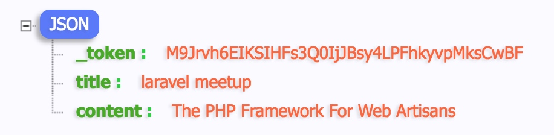

当代的网站不仅能够向访问者展示新型，也能去倾听访问者的声音。这个主要是通过 `form` 实现的。


## 增加路由

首页的 `发布新活动` 的按钮，链接改为

```html
<a href="{{route('issues.create')}}" ...>发布新活动</a>
```

web.php路由 中添加

```php
Route::get('issues/create', 'IssuesController@create')->name('issues.create');
```

> 注意：这一行路由要写在 `get 'issues/{issue}'` 的上面。这是因为`larave`的路由是从上往下匹配的，我们要让它先找到`编辑`，再去找`显示`。

## controller中显示新增页面

`IssuesController.php` 中添加

```php
public function create(){
    return view('issues.create');
}
```

## 增加create页面

然后创建 `resources/views/issues/create.html.erb`

1. 复制提供的`issues_create.html`，并后缀为`blade.php`。
2. 使用布局模板，相信大家都已经知道该怎么处理了。
3. 修改`form`的`action="{{route('issues.store')}}"`

```html
@extends('layouts.app')

@section('content')
    <div class="am-container">
        <div class="header">
            <div class="am-g">
                <h1>添加新活动</h1>
            </div>
            <hr>
        </div>

        <form class="am-form" action="{{route('issues.store')}}" method="post">
            <fieldset>
                <div class="am-form-group">
                    <label>标题</label>
                    <input type="text" placeholder="输入活动标题" name="title">
                </div>

                <div class="am-form-group">
                    <label>内容</label>
                    <textarea rows="5" name="content"></textarea>
                </div>

                <button type="submit" class="am-btn am-btn-default">提交</button>
            </fieldset>
        </form>
    </div>
@endsection
```

> Tips:
> 1. 目前注意的是`method` 和 `action`，因为他俩决定了表单的提交方式和要提交到哪里去。
> 2. 另一个要注意的是表单中的`name`，他决定了`laravel`收到后，值对应的名字叫什么。

浏览一下发现报错， `Route [issues.store] not defined.` 所以就知道 `web.php` 中应该怎么写了。

添加路由

```php
Route::post('issues', 'IssuesController@store')->name('issues.store');
```

## 接受数据

这样，就要在 IssuesController.php 中添加

```php
public function store(Request $request)
{
    return $request->all();
}
```

点击提交后，又报错了。这又是`laravel` 为了防止 `跨站请求伪造`，而采用的自我保护机制了。

所以我们要让`laravel`知道，当前提交表单的页面，是来自于他自己的。使用的方式就是
https://laravel.com/docs/5.5/csrf

要做的修改非常简单，就是到 `form标签` 中添加

```html
<form>
{{csrf_field()}}
...
</form
```

再次提交，可以看到我们提交的数据。



> Tips:
> 1. 这里显示的`_token`，就是刚才添加的`csrf_field`。只要有了这个值，`laravel`就会自动处理相关的安全问题。
> 2. 如果你想和我一样显示漂亮的数据格式，请给`chrome`浏览器安装`JSON-handle`或者`jsonView`等插件。

## 将数据添加到数据库中

```php
public function store(Request $request)
{
    Issue::create($request->all());
    return redirect('/');
}
```

`Issue.php`模型中，加上`content`白名单

```php
protected $fillable = ['title', 'content'];
```

这样再来提交，操作成功了。


