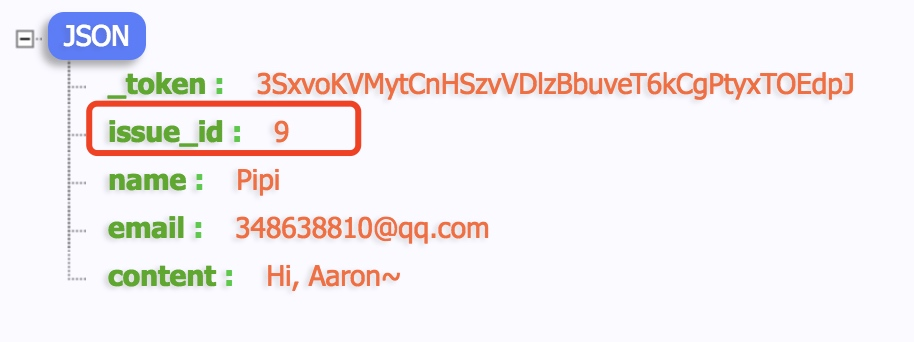

一个活动发布完成后，没有用户来互动这也太单调了。这一集要做的就是来添加用户评论。

在开始今天的课程之前，首先来思考一个非常简单的问题。
一个购物车里面，可以放多少件商品？


答案非常简单，有很多`(has many)`。这也就是我们`数据库关联`中所说的`一对多`关系。
做评论功能，关注的核心问题也是`has many`关系。一个`issue`，对应多个`comment`。

## 创建model和migration

```php
php artisan make:model Models/Comment -m
```

修改migration文件

```php
public function up()
{
    Schema::create('comments', function (Blueprint $table) {
        $table->increments('id');
        $table->integer('issue_id');
        $table->string('name');
        $table->string('email');
        $table->text('content');
        $table->timestamps();
    });
}
```

运行`migrate`，生成`comments`表。

```bash
php artisan migrate
```

> Tips: 为了体现归属关系，也就是一个 `issue` 对应多个 `comment` 的关系。要在`comments`中添加一个新的字段`issue_id`，这个在后面会有妙用。

## form

1. 创建`views/shared/_comment_box.blade.php`
2. `views/issues/show.blade.php`中`form`标签上方加上`@include('shared._comment_box')`
3. 剪切整个`form`部分到`_comment_box.blade.php`
4. 修改`form`。加上`action`、`csrf_feild()`

```html
<form class="am-form" method="post" action="{{route('comments.store')}}">
    {{csrf_field()}}
    <input type="hidden" name="issue_id" value="{{$issue->id}}">
    ...
</form>
```
>Tips: 因为`comments`表中，有一个`issue_id`。这里就需要放一个隐藏的`input`，将当前`issue`的`id`传递过去。

## route
`web.php`中加上

```php
Route::resource('comments', 'CommentsController', ['only' => 'store']);
```

>Tips: 这里的`only`的意思，我想你肯定一下就猜到了。因为只需要评论的添加功能，所以只需要`store`这一条路由。

## controller

```bash
php artisan make:controller CommentsController
```

还是先来检测一下，评论数据传递过来了没有

```php
public function store(Request $request)
{
    return $request->all();
}
```



当前发布评论所在页面的`issue_id`已经传递过来了

进一步修改为

```php
//一定记得要use model
use App\Models\Comment;

class CommentsController extends Controller
{
    public function store(Request $request)
    {
        Comment::create($request->all());
        return back();
    }
}
```

> Tips: 这里 `back()`的意思，就是返回上一页。

提交后，出现错误。这是因为我们模型中忘记添加白名单了。

## model

`Models/Comment.php`中，添加`白名单`

```php
class Comment extends Model
{
    protected $fillable = ['issue_id', 'name', 'email', 'content'];
}
```

再次提交后，打开`sequel pro`或`navicat`，观察评论是否已经存进`comments`表了。
成功后，再来提交另一条评论。

## comment模板

1. 到 `views/issues/show.blade.php` 中添加 `@include('shared/_comment_list')`
2. 创建 `shared/_comment_list.blade.php`
3. 将之前写死的评论内容，剪切到`_comment_list.blade.php`中

现在不太好办的一个事就是如何得到这个 issue 下的所有 comment 。这时候我多么多么希望在 `IssuesController` 的 `show` 方法中，我可以使用这样的语句啊

```php
public function show($id)
{
    $issue = Issue::find($id);
    
    //当前issue的comments
    $comments = $issue->comments;
    return $comments;
}
```

现在刷新一下页面，只会得到一片空白...

其实这在laravel中完全是可以轻松实现的，方法就是https://laravel.com/docs/5.5/eloquent-relationships

## 建立一对多的关系

第一步，确保`comments` 表里面有 `issue_id` 这个字段，注意，名字一个字都不能错，因为要用它和 `issues` 表去产生映射关系。

第二步，到`Issue.php`模型中添加

```php
public function comments()
{
    return $this->hasMany('App\Models\Comment');
}
```

> Tips: 一个`issue`有很多个`comment`，所以这里要用复数的`comments`。

第三步，到`Comment.php`模型 中，添加

```php
public function issue()
{
    return $this->belongsTo('App\Models\Issue');
}
```

> Tips: 每个`comment`只都属于一个`issue`，所以这里的`issue`是单数。

好了，就是这简单的三步。`issue`与`comment`的关联关系就已经定义完毕了。
再来刷新一下页面，`comments`出现了。

最后一步，完成`show`方法

```php
public function show($id)
{
    $issue = Issue::find($id);
    $comments = $issue->comments;
    return view('issues.show', compact('issue', 'comments'));
}
```

>Tips: 如果需要发送多个数据到模板，可以使用`php`的`compact`函数来简化代码。


## 显示comment

`shared/_comment_list.blade.php`中，加上`foreach`

```php
@foreach($comments as $comment)
    <li class="am-comment">
        

        <div class="am-comment-main">
            <header class="am-comment-hd">
                <div class="am-comment-meta">
                    <span class="am-comment-author">{{$comment->name}}</span>
                    {{$comment->created_at->diffForHumans()}}
                </div>
            </header>
            <div class="am-comment-bd">{{$comment->content}}</div>
        </div>
    </li>
@endforeach
```

不错，之前发布的评论已经正确的显示出来了。

## 用户头像

目前还有一点不完美的是，所有用户的头像，都显示了Pipi的头像。
这个地方我们使用 http://en.gravatar.com/ 的服务来解决问题。如果用户使用过`gravatar`，它是可以通过 `email`地址来取得用户的头像的。

到`Comment.php`模型中

```php
public function avatar()
{
    return "https://www.gravatar.com/avatar/" . md5(strtolower($this->email)) . "?d=retro&s=48";
}
```

这样到 `views/shared/_comment_list.blade.php` 中，

```html
avatar()}}" ...>
```

这样就可以正确显示头像了。


